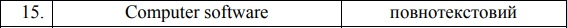
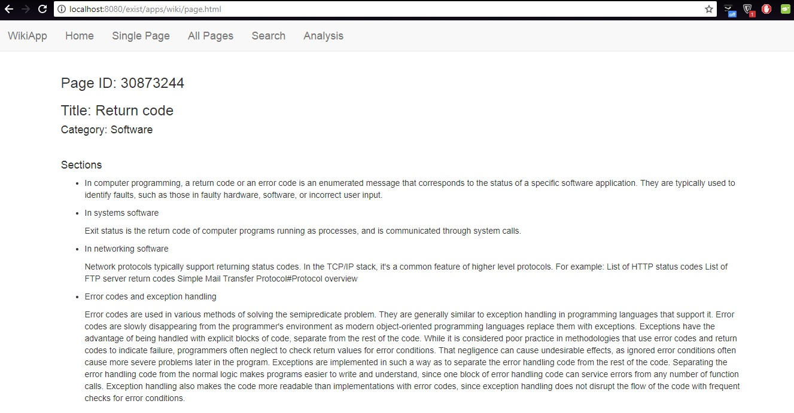
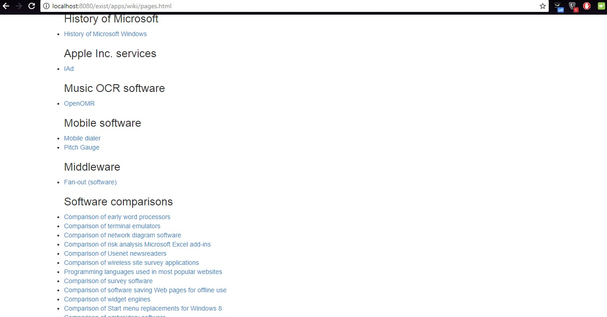
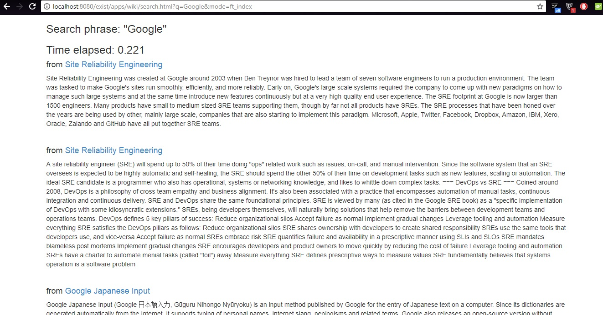

Lab 2
============
Task:
---
1. Виконати збір документів зі сторінок англійською мовою Web-сайту Wikipedia за визначеною варіантом категорією.
2. Виконати індексацію завантажених документів (вид індексу визначається варіантом).
3. Реалізувати функціональні можливості згідно вимог, наведених нижче.
***
Functional requirements:
---
1. Документи у форматі XML з сайту Wikipedia (https://en.wikipedia.org) завантажувати, використавши прикладний програмний інтерфейс API (див. https://www.mediawiki.org/wiki/API:Main_page). Обмежитись 10 категоріями. В кожній категорії - 100 документів. У якості клієнтської програми для завантаження даних використовувати утиліту cURL.
2. Реалізувати функцію повнотекстового або атрибутивного (за діапазоном чисел) пошуку згідно з варіантом щодо індексації. Впевнитись у ефективності використання індексів засобами роботи з часом eXist.
3. Виконати частотний аналіз завантажених документів і вивести список 100 найвживаніших слів серед усіх документів.
***
Variant:
---

***
Single Page:
---

***
All Pages:
---

***
Search:
---

***
