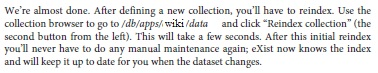

* application name: wiki
* How to create a server application in eXist: https://exist-db.org/exist/apps/doc/development-starter.xml
* Insert all folders from arranged_xml (see "python" folder outside this folder) to "data" folder inside the application folder
---
How to re-index your collection for full-text search to work:
1. Create a collection (folder) inside your application: "system\config\db\apps\wiki"
2. Create a file there: collection.xconf
3. Fill it with the contents from this repository (check the same path as in 1. and 2. paragraps here)
4. Re-index the collection itself:\

---
"Analysis" function has a very poor design and results in infinite load when you try to call it for all of your .xml documents.
Instead, try to perform analysis for one folder only.
To do this, change in "db\apps\wiki\modules\app.xql" (line 165):
```
let $documents := collection("/db/apps/wiki/data//?select=*.xml")
```
to
```
let $documents := collection("/db/apps/wiki/data/{Software}/?select=*.xml")
```
where {Software} is some folder from your "data" folder. Please make sure you use folder with simple name without spaces or special characters (might not work)
Example of simple names of folders: "Software", "4GL", "AS", "Adware", "Amiga" and so on.
