Lab 1
============
Variant:
---
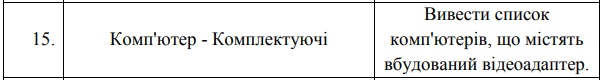
***
Database structure
------------
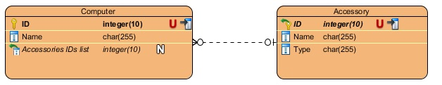
***
Menu
------------
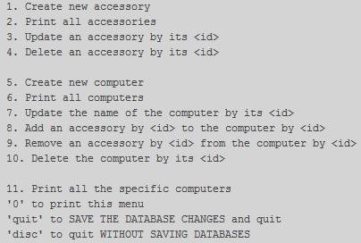
***
Create new accessory
------------
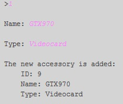
***
Print all accessories
------------
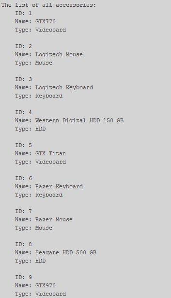
***
Update an accessory
------------
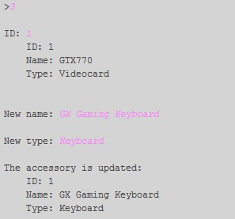
***
Delete an accessory
------------
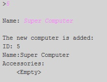
***
Create new computer
------------
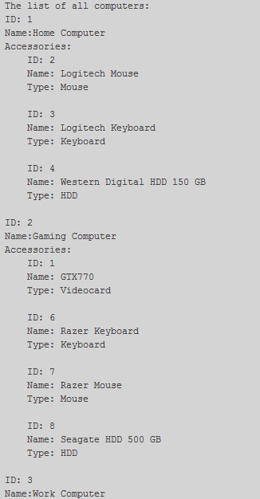
***
Print all computers
------------
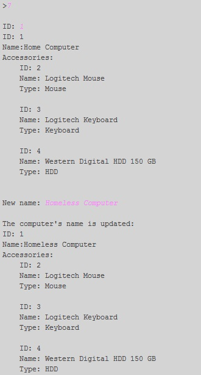
***
Update the name of the computer
------------

***
Add an accessory to the computer
------------
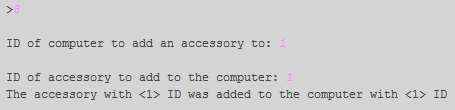
***
Remove an accessory from the computer
------------
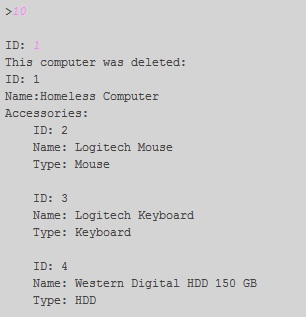
***
Delete the computer
------------
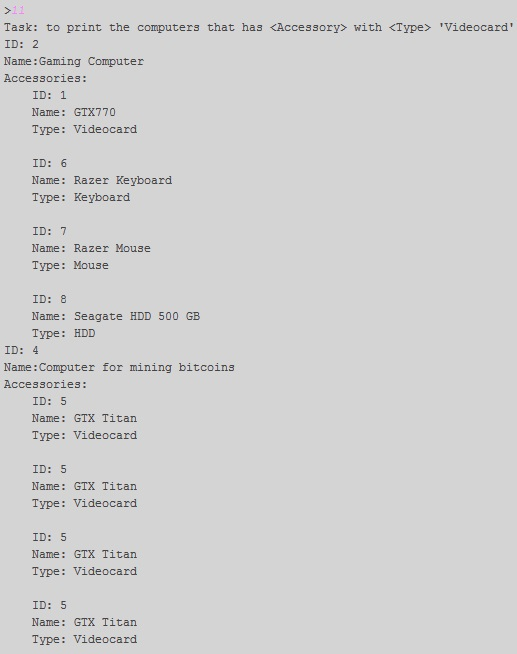
***
Print all the computers with "Videocards"
------------

***