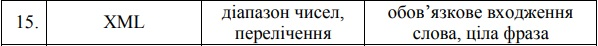
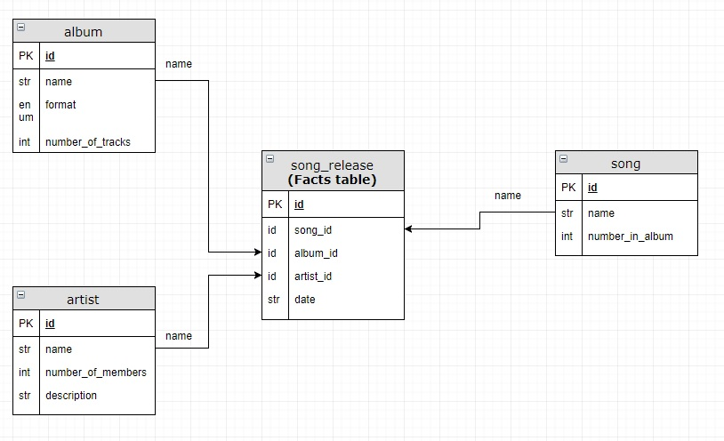
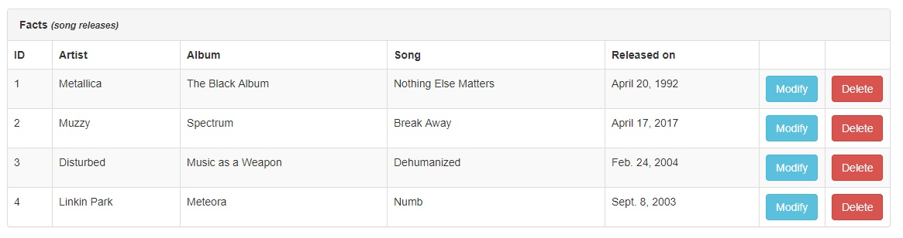
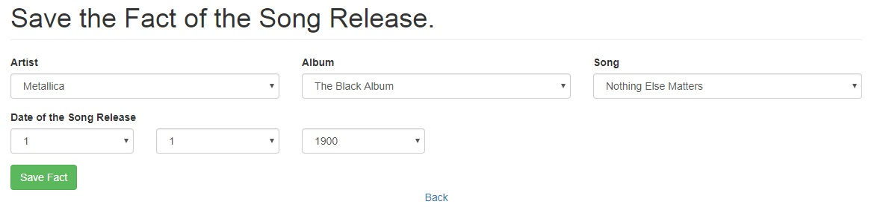
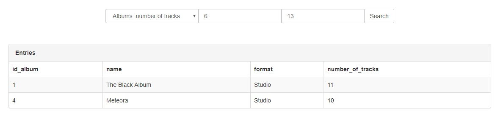
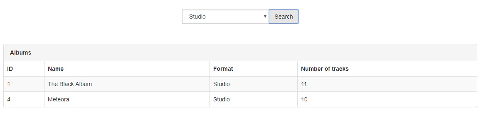
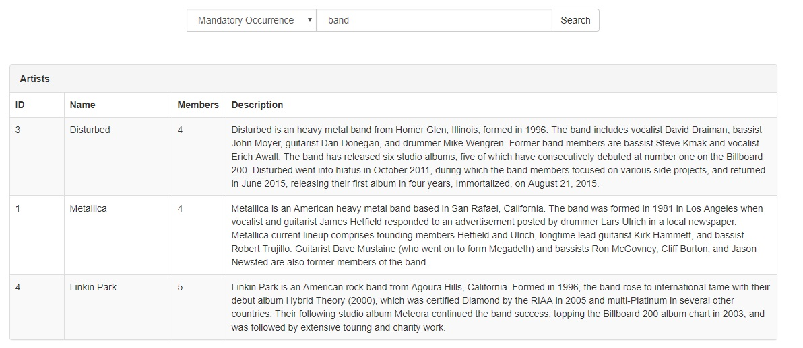
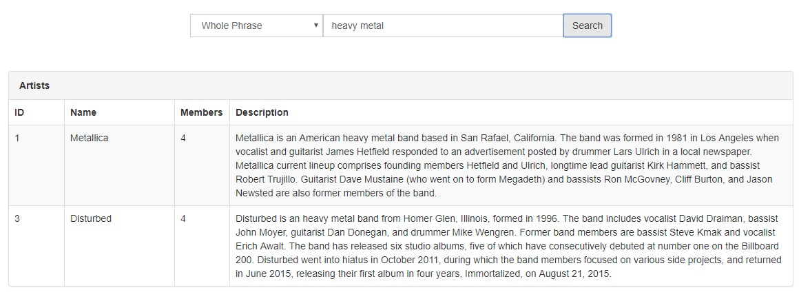

Lab 2
============
Variant:
---

***
Database structure
------------

***
Read Facts
------------

***
Create Facts
------------

***
Search (Numbers)
------------

***
Search (ENUM)
------------

***
Search (Text, Mandatory Occurrence)
------------

***
Search (Text, Whole Phrase)
------------

***